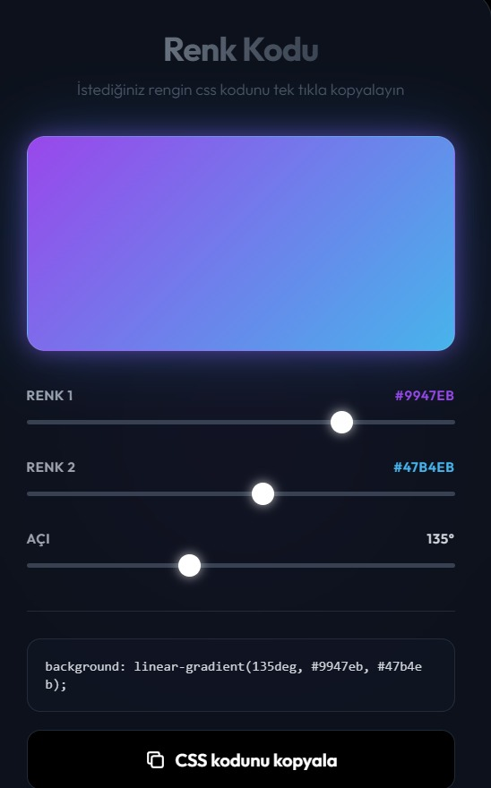
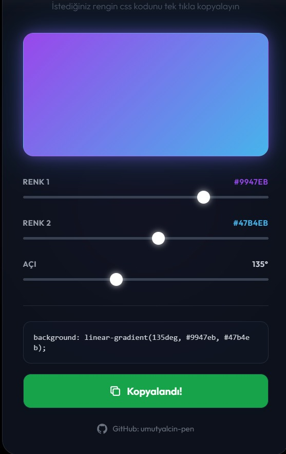
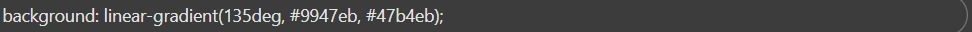

# Web projeleriniz için tek tıkla neon renkler oluşturun ve CSS kodunu tek tıkla kopyalayın.

    

---

## Eklenti ile alakalı ekran görüntüleri / Screenshots related to the extension

  
  
  

---

### 🇹🇷 GitHub Açıklaması 
Renk Kodu Üreticisi (CSS Linear Gradient) 🎨
Kullanıcıların anında önizleme yaparak özelleştirilmiş CSS lineer gradyan kodları oluşturmasını sağlayan şık bir araç. İki renk tonu ve gradyan açısı kolayca ayarlanabilir.

Özellikler: Etkileşimli kontroller, canlı önizleme, otomatik Hex/CSS kodu üretimi.

Tasarım: Dark mode, "Glassmorphism" ve neon efektleri.

---

### 🇬🇧 English Description 
Color Code Generator (CSS Linear Gradient) 🎨
A stylish web tool that allows users to create customized CSS linear gradient codes with an instant preview. Easily adjust two color hues and the gradient angle.

Features: Interactive controls, live preview, automatic Hex/CSS code generation.

Design: Dark mode, "Glassmorphism," and neon aesthetics.

---

## 💻 Proje Teknolojileri: / Project Technologies:

    
    
    

---

## ℹ️ Ek Bilgiler / Additional Information

* Bu basit site ile tek tıkla istediğiniz renk paletini oluşturup anında css kodunu yazınıza kopyalayabilirsiniz.
* With this simple site, you can create the color palette you want with a single click and copy it to your text by instantly coding it with CSS.

---

